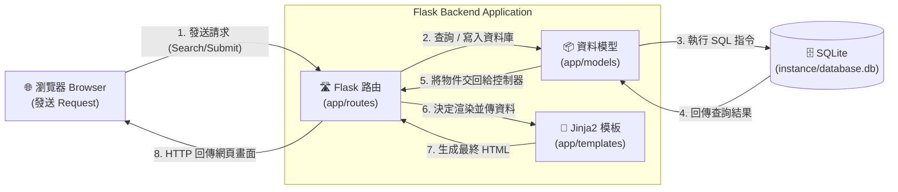

# 讀書筆記本 - 系統架構設計 (Architecture)

## 1. 技術架構說明
本專案採用輕量級的後端渲染架構，適合快速打造出符合 MVP 的「讀書筆記本」系統。

### 選用技術與原因
- **後端框架：Python + Flask**
  - **原因**：Flask 是一個輕量、靈活的微框架，學習曲線低，彈性大，非常適合小型專案或 MVP 產品的快速迭代。
- **模板引擎：Jinja2**
  - **原因**：Jinja2 原生整合於 Flask 中。本專案初期不採用前後端分離（SPA 單頁應用），而是直接由後端渲染 HTML。這樣能大量減少開發初期的 API 串接成本與狀態管理複雜度，也更容易讓搜尋引擎爬取內容 (SEO)。
- **資料庫：SQLite**
  - **原因**：SQLite 是一個輕量的本機端關聯式資料庫系統（RDBMS），只需一個檔案即可儲存資料，完全滿足初期讀書筆記 MVP 的資料儲存與查詢需求，開發者無須架設額外的資料庫伺服器。

### Flask MVC 模式說明
雖然 Flask 本身並未強制硬性規範 MVC（Model-View-Controller）資料夾架構，但我們會採用 MVC 的基礎觀念來組織程式碼與維持關注點分離：
- **Model（模型）**：負責定義與 SQLite 互動的資料結構，封裝處理關於書籍、使用者資料庫存取的邏輯。
- **View（視圖）**：對應到 Jinja2 模板（即 `.html` 檔案），負責將準備好的資料以網頁前端介面的方式呈現給使用者。
- **Controller（控制器）**：對應到 Flask 的 Route (路由) 函式。負責接收瀏覽器的請求 (Request)，從 Model 取出或更新資料，然後把資料傳遞給指定的 View 進行網頁渲染，最終回傳給使用者。

## 2. 專案資料夾結構

建議採用以下的標準 Flask 目錄結構配置，能清楚劃分路由、資料庫邏輯、模板與靜態資源。

```text
讀書筆記本/
├── app/                      # 核心應用程式目錄
│   ├── __init__.py           # Flask App factory 建立與初始化
│   ├── models/               # 資料庫模型結構 (Models)
│   │   ├── __init__.py
│   │   ├── user.py           # 用戶帳號模型
│   │   └── review.py         # 讀書心得模型
│   ├── routes/               # Flask 路由配置 (Controllers)
│   │   ├── __init__.py
│   │   ├── auth.py           # 負責註冊、登入與登出邏輯
│   │   ├── review.py         # 負責新增、編輯與刪除心得
│   │   └── main.py           # 負責首頁列表與搜尋功能
│   ├── templates/            # Jinja2 HTML 模板 (Views)
│   │   ├── base.html         # 母版（共用的 Header, Footer 等）
│   │   ├── index.html        # 首頁：心得列表與搜尋畫面
│   │   ├── login.html        # 登入頁面
│   │   ├── register.html     # 註冊頁面
│   │   ├── review_detail.html# 單篇讀書心得詳細閱覽頁
│   │   └── review_form.html  # 新增 / 編輯心得表單頁面
│   └── static/               # 前端靜態資源
│       ├── css/
│       │   └── style.css     # 全域樣式表
│       └── js/
│           └── main.js       # 客製化 Javascript
├── instance/                 # 本機環境與敏感資料夾 (應加入 .gitignore)
│   └── database.db           # SQLite 實際資料存放檔案
├── docs/                     # 專案規格文件區
│   ├── PRD.md                # 產品需求文件
│   └── ARCHITECTURE.md       # 系統架構設計 (本文件)
├── app.py                    # 快速啟動入口程式碼
└── requirements.txt          # Python 執行環境依賴套件清單
```

## 3. 元件關係圖

以下使用 Mermaid 結構圖展示使用者發出請求後，系統內部的各元件如何依序被觸發與回應。



## 4. 關鍵設計決策

1. **統一由 Server-Side Rendering (SSR) 產生頁面**
   - **原因**：既然以「文章展示、個人筆記留存」為主，「讀書筆記本」若採 SSR 架構可免除跨域問題 (CORS)，且減少前後端通訊、狀態管理庫等前期開發門檻。最重要的是較佳的基礎 SEO 適性，能滿足訪客找尋他人讀書心得的需求。
2. **採用 Flask Blueprint 拆分 Routes，而非全塞入 `app.py`**
   - **原因**：為了專案目錄易讀性，我們按功能模塊（模組：會員系統、心得系統、基礎服務）拆分 Controllers，這能避免隨著日後心得列表邏輯增加，全部混接在一起造成的難以維護問題。
3. **採用基於 Session Cookies 的認證機制**
   - **原因**：因不採用單頁應用程式 (SPA)，我們可以直接依賴 Flask 的原生 Session 機制進行加密安全 Cookie (Secure Cookies) 發送。使用 Session 來進行登入授權會最直觀可靠，減少實作 Token 的風險與麻煩。
