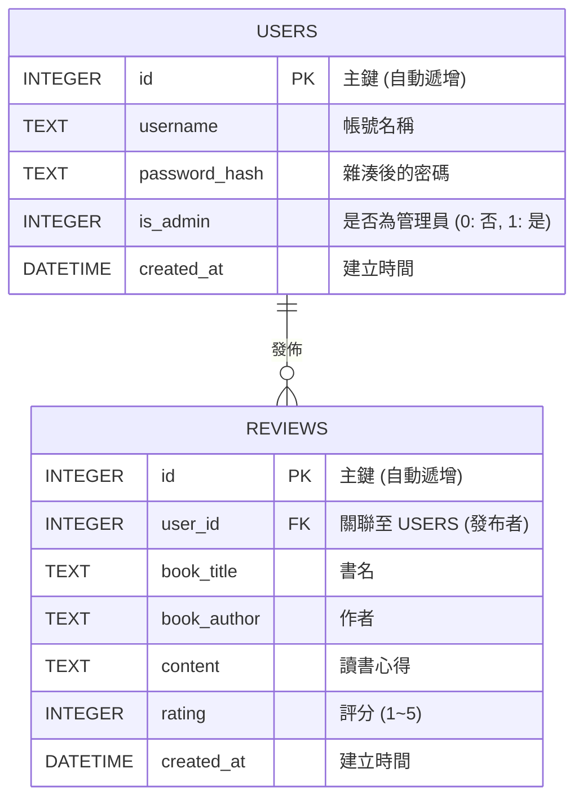

# 讀書筆記本 - 資料庫設計 (DB Design)

這份文件基於流程圖與需求文件產出，定義了「讀書筆記本」初期 MVP 會用到的核心資料表。

## 1. ER 圖（實體關係圖）

本專案初期規劃兩個基礎模型：使用者（User）與心得（Review）。一個使用者可以發布多篇心得（一對多關聯）。

## 2. 資料表詳細說明

### 2.1 `users` 資料表 (使用者)
負責儲存一般讀者與管理員的帳號密碼與權限資訊。

| 欄位名稱 | 型別 | 必填 | 說明 |
| --- | --- | --- | --- |
| `id` | INTEGER | 是 | Primary Key，自動遞增流水號。 |
| `username` | TEXT | 是 | 唯一帳號，用來登入與顯示暱稱。 |
| `password_hash` | TEXT | 是 | 經過雜湊處理的密碼，保護儲存安全。 |
| `is_admin` | INTEGER | 是 | 用來區分讀者(`0`)或管理員(`1`)，預設為 `0`。 |
| `created_at` | DATETIME | 是 | 帳號創立的 timestamp。 |

### 2.2 `reviews` 資料表 (讀書心得)
儲存使用者對書籍撰寫的所有評價與心得。

| 欄位名稱 | 型別 | 必填 | 說明 |
| --- | --- | --- | --- |
| `id` | INTEGER | 是 | Primary Key，自動遞增流水號。 |
| `user_id` | INTEGER | 是 | Foreign Key，對應至 `users.id`，標示為誰撰稿的。 |
| `book_title` | TEXT | 是 | 書名，作為搜尋標的。 |
| `book_author` | TEXT | 否 | 書籍作者。可以留空。 |
| `content` | TEXT | 是 | 使用者的讀書心得筆記內文。 |
| `rating` | INTEGER | 是 | 對書籍的評分，限制在 1 到 5 的數字。 |
| `created_at` | DATETIME | 是 | 心得發布的時間。 |

## 3. SQL 建表語法

詳細建立語法請參考 `database/schema.sql` 檔案。

## 4. Python Model 程式碼
基於輕量化原則，我們使用內建的 `sqlite3` 來建立 Model。
已為各資料表產生以下實作檔案：
- `app/models/user.py`
- `app/models/review.py`
