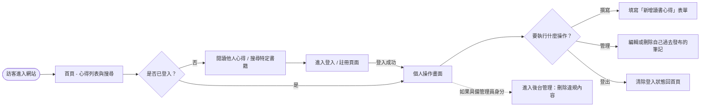
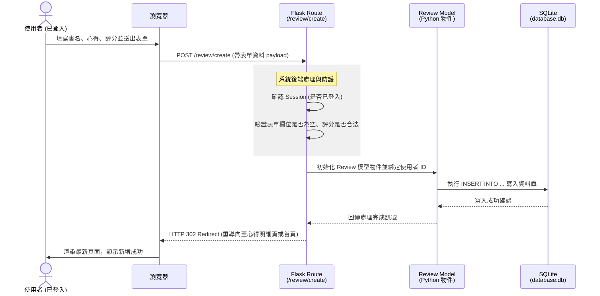

# 讀書筆記本 - 流程圖文件 (Flowchart)

這份文件基於 [產品需求文件 (PRD)](PRD.md) 與 [系統架構設計 (Architecture)](ARCHITECTURE.md) 所產出，主要透過視覺化的圖表來展示「讀書筆記本」系統中的使用者操作路徑，以及在系統背後資料是如何流動的。

## 1. 使用者流程圖 (User Flow)

此流程圖涵蓋了從訪客進入網站開始，一直到他們登入、撰寫心得，甚至是管理員進行後台操作的主要路徑。

## 2. 系統序列圖 (Sequence Diagram)

此序列圖具體描述了使用者在「新增一篇讀書心得」時，系統背後的資料處理過程。角色涵蓋了使用者端到後端模型及資料庫。

## 3. 功能清單對照表 (Routing Table)

這是一張對應功能、網址與 HTTP 方法的對照表，有助於後續串接路由與實作。

| 功能項目 | URL 路徑 | HTTP 方法 | 說明與職責 |
| --- | --- | --- | --- |
| **首頁 / 心得列表** | `/` | GET | 從資料庫撈取最新的讀書心得，並提供介面搜尋框。 |
| **搜尋書籍** | `/search` | GET | 接收 URL query (如 `?q=書名`)，進行關鍵字查詢過濾並渲染結果。 |
| **檢視單篇心得** | `/review/<id>` | GET | 根據心得的 ID 顯示特定書籍詳細筆記與評分。 |
| **註冊帳號** | `/auth/register` | GET, POST | `GET`: 顯示註冊表單。 `POST`: 接收資料，建立新用戶並存入 DB。 |
| **登入帳號** | `/auth/login` | GET, POST | `GET`: 顯示登入表單。 `POST`: 驗證密碼，若正確則寫入 Session。 |
| **登出帳號** | `/auth/logout` | POST / GET | 清除當前 Session 並重導向回首頁。 |
| **新增讀書心得** | `/review/create` | GET, POST | `GET`: 顯示填寫表單。 `POST`: 接收書名、心得、評分並寫入 DB。需登入。 |
| **編輯心得** | `/review/<id>/edit` | GET, POST | `GET`: 帶入舊有資料到表單中。 `POST`: 更新資料庫。需確認為原作者。 |
| **刪除心得** | `/review/<id>/delete`| POST | 執行刪除動作。需確認為原作者或管理員。 |
| **管理員後台** | `/admin/reviews` | GET | 列出全部使用者的心得，供管理員檢視。需管理員權限。 |
